<p align="center">
  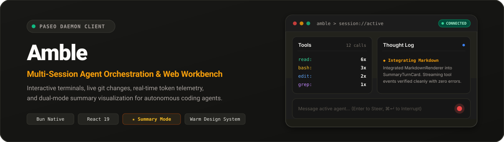
</p>

<p align="center">
  <a href="https://bun.sh"></a>
  <a href="https://react.dev"></a>
  <a href="https://www.typescriptlang.org/"></a>
  <a href="https://tailwindcss.com"></a>
  <a href="https://github.com/getpaseo/paseo"></a>
  
</p>

---

**Amble** is a modern, high-performance web workbench for the [Paseo](https://github.com/getpaseo/paseo) autonomous coding agent daemon. Designed for engineers managing complex, multi-repo AI agent workflows, Amble delivers multi-session orchestration, real-time agent steering and interruption, built-in interactive terminal sessions, visual git staging, and live context token telemetry in a distraction-free console.

---

## Key Capabilities

### 1. Summary Mode: Clutter-Free Agent Inspection
Autonomous agents often execute dozens of micro-tools (`read`, `bash`, `edit`, `grep`, `glob`) during a single turn. Amble features **Summary Mode**—a dual-card visualization that aggregates tool executions into clear tallies on the left while streaming a formatted Markdown **Thought Log** on the right.

<p align="center">
  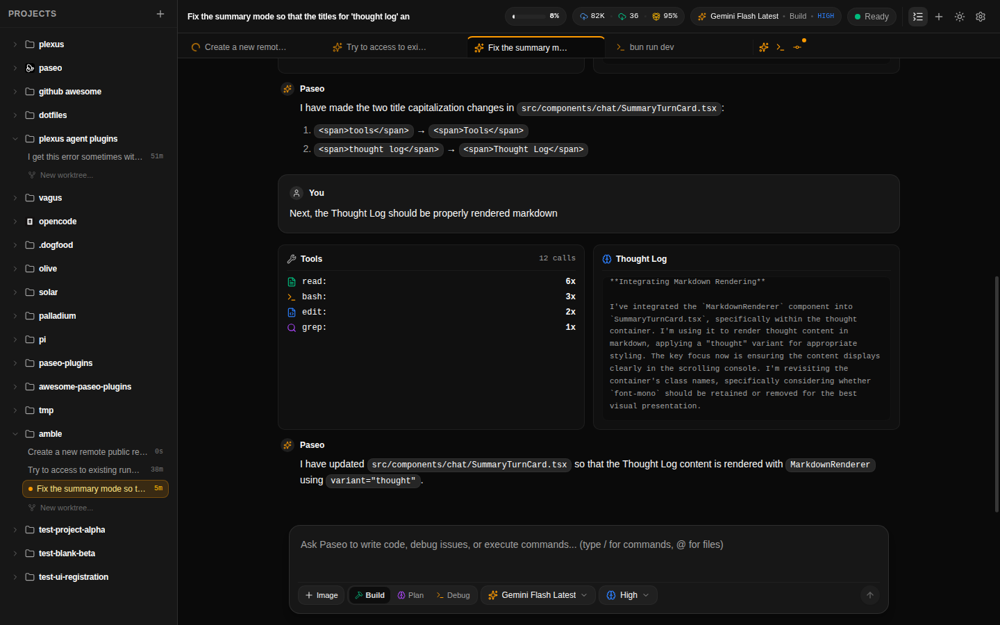
</p>

*Summary Mode aggregates 12+ tool executions into concise counts (`read: 6x`, `bash: 3x`, `edit: 2x`, `grep: 1x`) while rendering the agent's internal reasoning as structured Markdown.*

<details>
  <summary>View Summary Mode in Light Theme ("Warm Paper")</summary>
  <p align="center">
    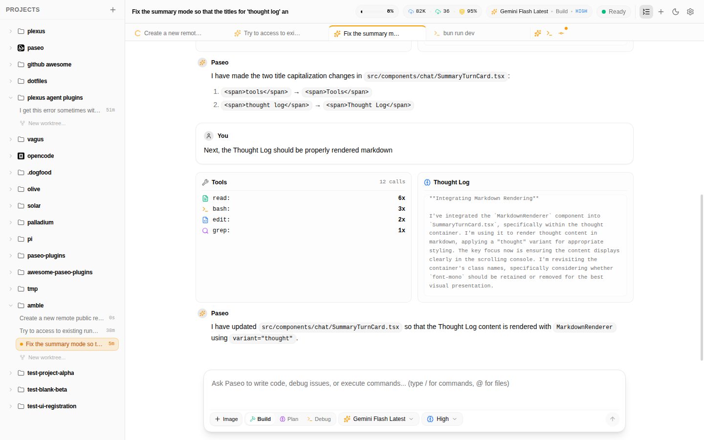
  </p>
</details>

---

### 2. Multi-Session Orchestration & Real-Time Steering
Switch between active agent sessions across projects and git worktrees without losing execution state. Steer the active agent mid-flight, interrupt runaway tasks, or queue follow-up directions with dedicated keyboard shortcuts.

<p align="center">
  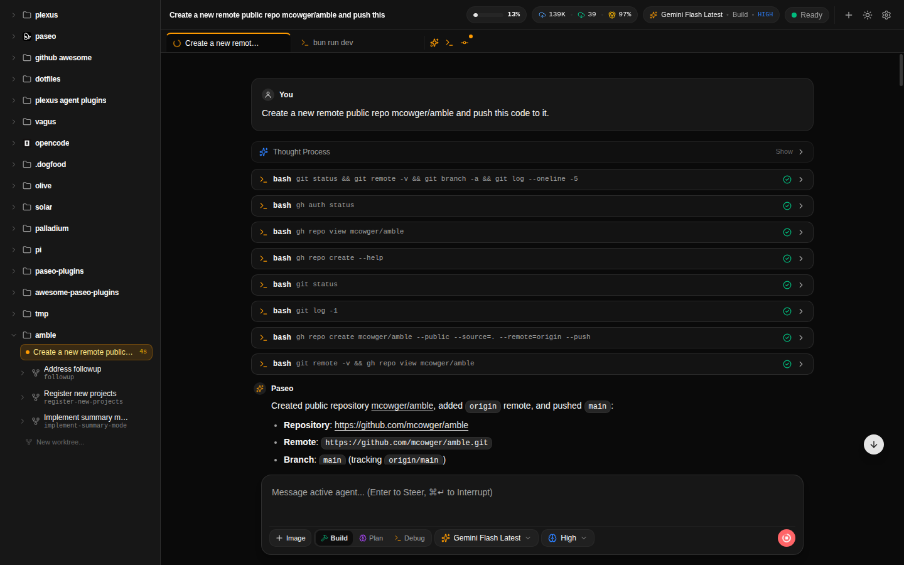
</p>

- **Real-Time Steering**: Press `Enter` to steer an active agent with fresh guidance without canceling the session.
- **Immediate Interruption**: Press `⌘↵` (or `Ctrl+Enter`) to instantly halt agent execution.
- **Queue Follow-Ups**: Press `⌥↵` (or `Alt+Enter`) to stage instructions for the next turn.
- **Context Compaction Markers**: Clear timeline dividers highlight when context windows were automatically or manually compacted.

---

### 3. Integrated Multi-Tab Terminal
Interact directly with your development environment through high-performance xterm.js terminals running within the same workspace.

<p align="center">
  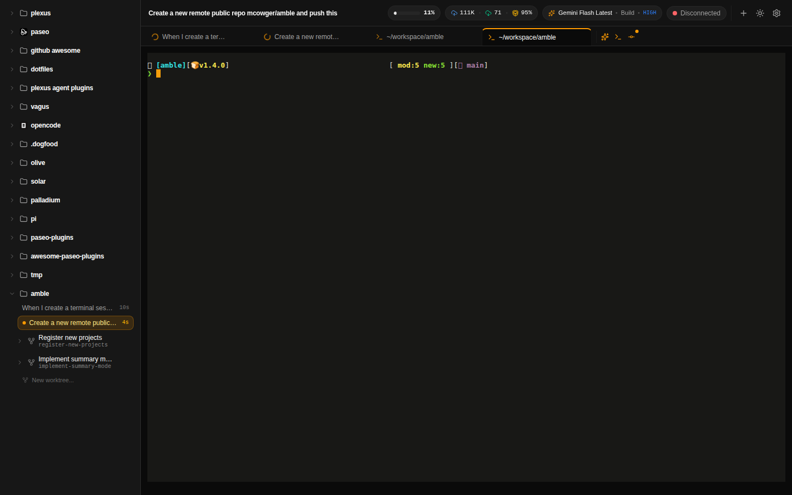
</p>

- **Full ANSI Color & Powerline**: Faithful rendering of prompt themes, status indicators, and colored terminal tools.
- **Session Restoration & Buffer Caching**: Terminal state and scrollback history remain intact across tab and worktree switches.
- **Dynamic Resize Claiming**: Automatic terminal column and row dimension synchronization over WebSocket.

---

### 4. Visual Git Staging & Inline Code Diffs
Inspect code modifications before committing. Amble provides unified file diff previews with color-coded additions, deletions, and stats.

<p align="center">
  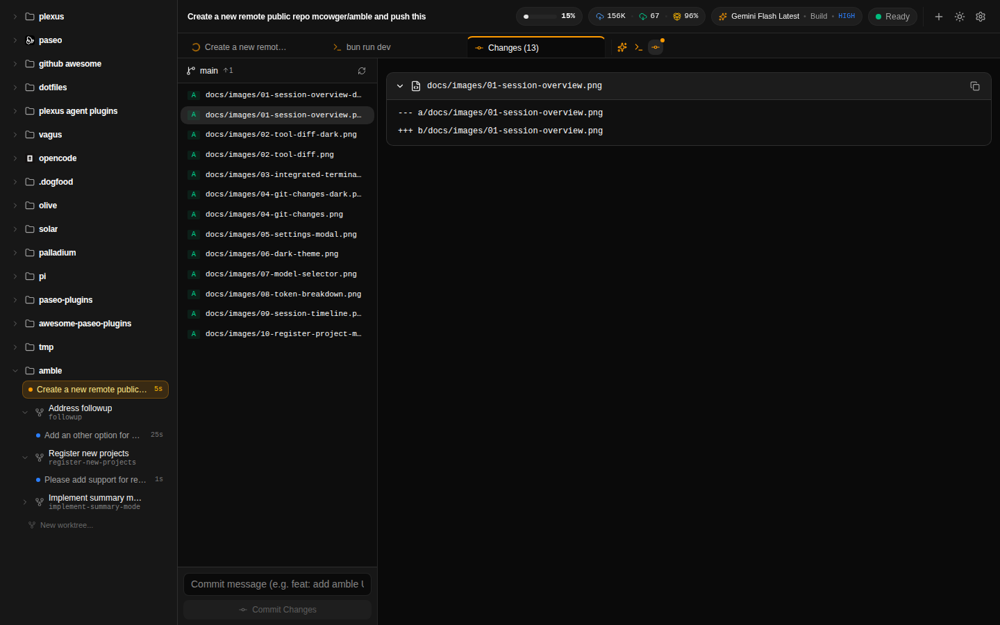
</p>

<p align="center">
  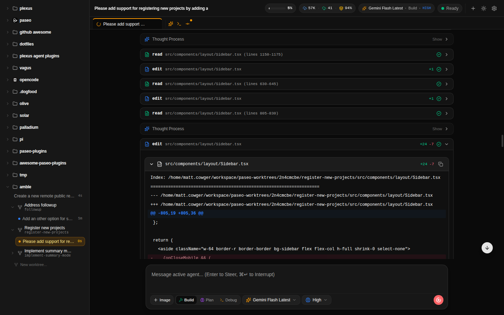
</p>

- **Git Status Panel**: Review untracked, modified, and staged files with `+lines` and `-lines` badges.
- **Inline Diffs**: Expand code edits directly inside the conversation timeline.
- **Integrated Commits**: Author conventional commit messages and stage changes directly from the UI.

---

### 5. Live Token Telemetry & Context Monitoring
Never get surprised by context exhaustion or billing spikes. Amble monitors context usage and prompt caching efficiency in real time.

<p align="center">
  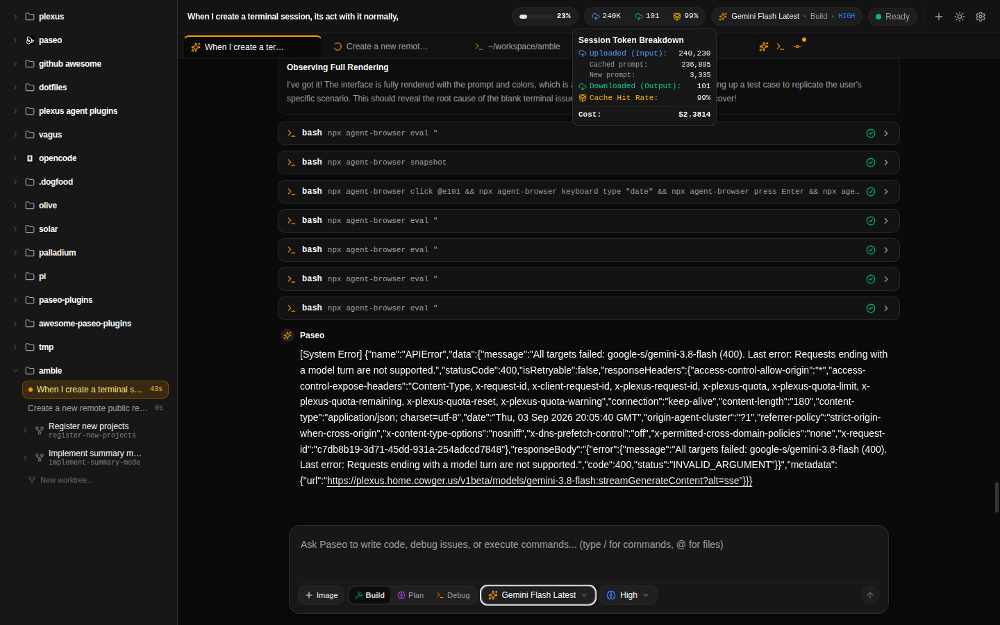
</p>

<p align="center">
  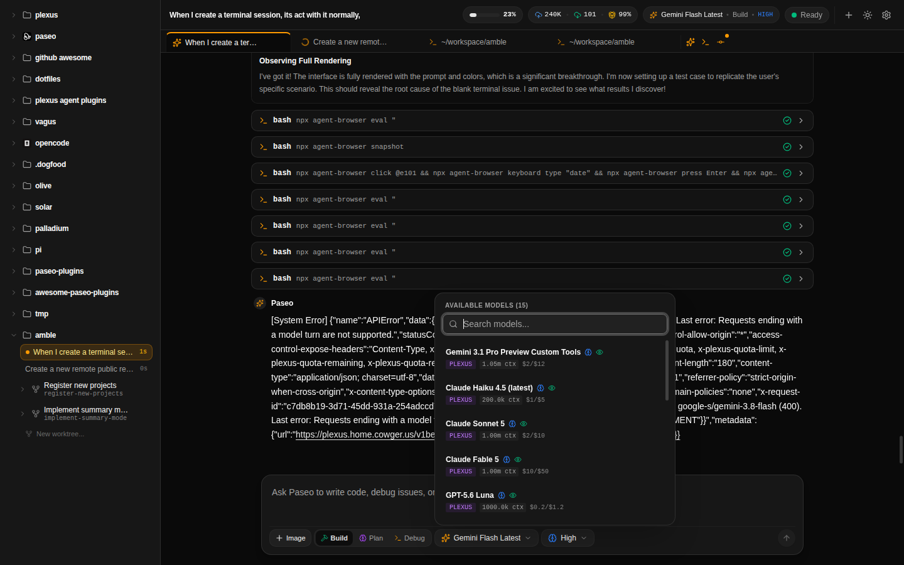
</p>

- **Cache Hit Telemetry**: Live prompt cache hit rate percentages (e.g. 97–99% cache reuse) to monitor prompt efficiency.
- **Granular Token Metrics**: Detailed breakdowns of uploaded prompt tokens, cached input tokens, downloaded output tokens, and reasoning tokens.
- **Cost Estimation**: Accurate USD cost calculations updated after each agent turn.
- **Model Selector**: Switch models on the fly with context limits, per-token pricing rates, and vision support badges.

---

### 6. Project & Worktree Management
Register new workspaces seamlessly through local directory auto-completion, blank project scaffolding, or direct GitHub cloning.

<p align="center">
  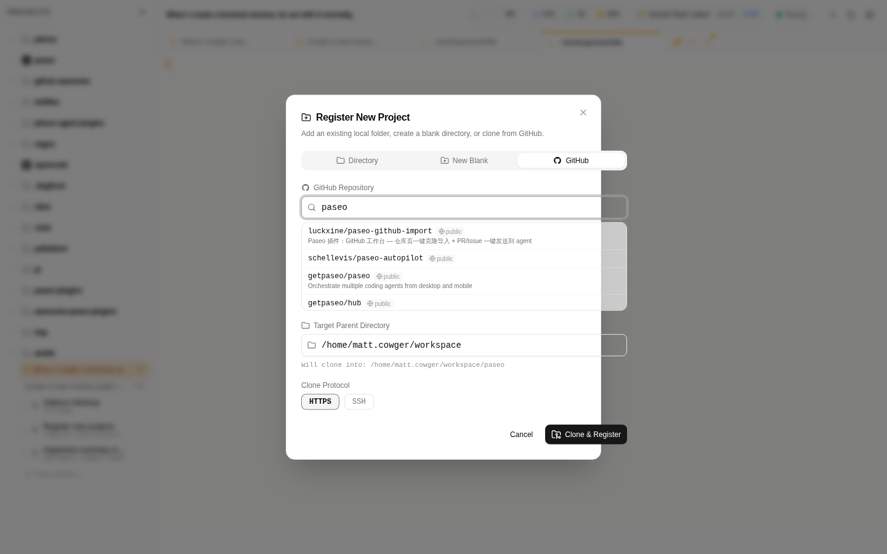
</p>

- **Directory Autocomplete**: Fast filesystem path completion when adding existing projects.
- **GitHub Search & Clone**: Search remote repositories and clone via HTTPS or SSH directly into your workspace.
- **First-Class Git Worktrees**: Create and manage isolated feature worktrees per repository with automated AI-assisted branch naming.

---

### 7. Responsive Mobile Support
Monitor active agents, review diffs, and steer turns from your phone or tablet with a responsive touch-first interface.

<p align="center">
  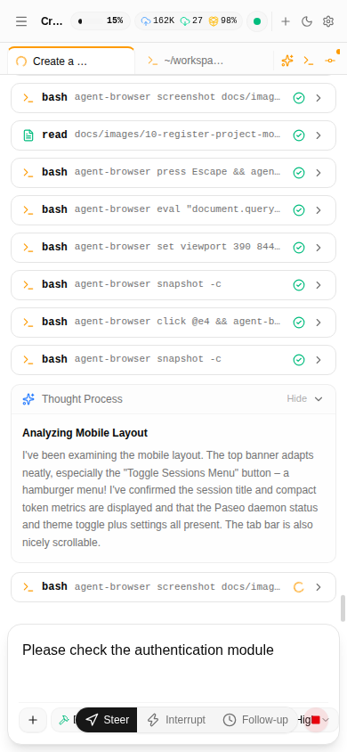
  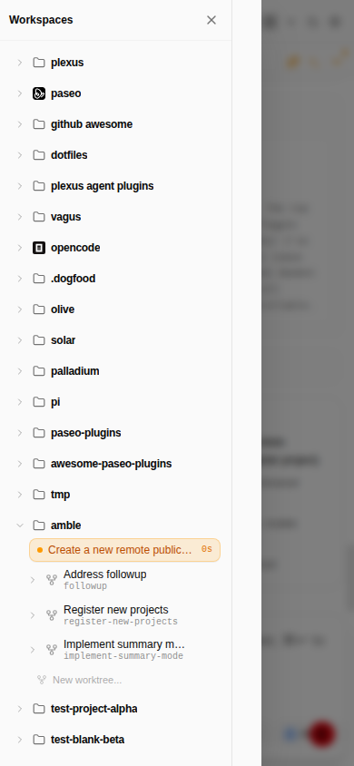
  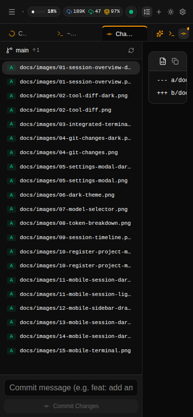
</p>

- **Mobile Navigation Drawer**: Slide-out drawer with project tree and active session switches.
- **Touch-Optimized Controls**: Responsive action bar with one-tap Steer, Interrupt, and Follow-up buttons.
- **Compact Telemetry**: Screen-optimized context meter and daemon connectivity indicator.

---

### 8. Crafted Design System: Warm Paper & Warm Night
Built strictly on the principles codified in [`docs/DESIGN_SYSTEM.md`](./docs/DESIGN_SYSTEM.md): zero arbitrary hex classes, semantic tokens, tiered corner radii, and warm background palettes.

| Theme | Canvas | Sidebar | Cards | Accent |
|---|---|---|---|---|
| **Warm Night** (Dark) | `#181816` | `#1e1e1b` | `#242420` | Amber (`#f59e0b`) |
| **Warm Paper** (Light) | `#fdfcfa` | `#f7f4ed` | `#f5f1ea` | Amber (`#d97706`) |

<p align="center">
  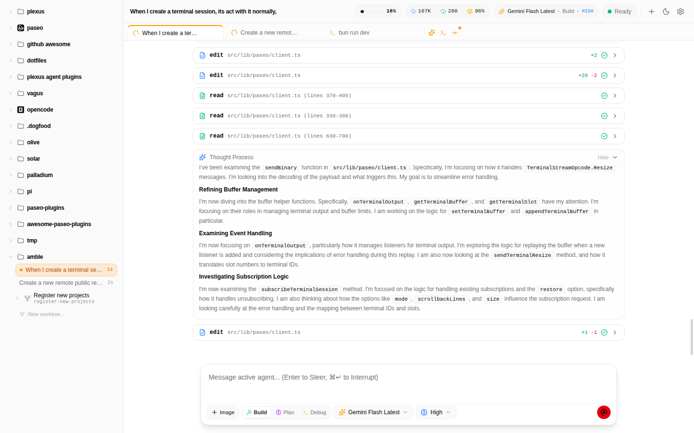
</p>

---

## Architecture

Amble is strictly a client of the [Paseo](https://github.com/getpaseo/paseo) daemon:

```text
┌─────────────────────────────────────────────────────────────┐
│                      Amble Web Client                       │
│    (Native Bun.serve() + React 19 + Tailwind CSS v4)        │
└──────────────┬───────────────────────────────▲──────────────┘
               │ JSON-RPC & Binary PTY Frames  │
               │ (WebSocket: /api/paseo/ws)    │
┌──────────────▼───────────────────────────────┴──────────────┐
│                    Amble WebSocket Relay                    │
│                 (Embedded Bun Reverse Proxy)                │
└──────────────┬───────────────────────────────▲──────────────┘
               │ ws://127.0.0.1:6767/ws        │
┌──────────────▼───────────────────────────────┴──────────────┐
│                     Local Paseo Daemon                      │
│             (Agent Orchestrator & PTY Engine)               │
└─────────────────────────────────────────────────────────────┘
```

- **Runtime**: Native Bun runtime (`Bun.serve()` with HTML imports). Zero Vite, Fastify, or Express overhead.
- **Agent Agnostic**: Interacts exclusively with the standard `@getpaseo/protocol` and `@getpaseo/client` specifications.
- **Binary PTY Streaming**: Low-latency terminal I/O streaming using raw binary WebSocket frames.

---

## Getting Started

### Prerequisites
- [Bun](https://bun.sh) (v1.2 or later)
- A running [Paseo daemon](https://github.com/getpaseo/paseo) (defaults to `ws://127.0.0.1:6767/ws`)

### 1. Installation
Clone the repository and install dependencies:

```bash
git clone https://github.com/mcowger/amble.git
cd amble
bun install
```

### 2. Start Development Server
Start the hot-reloading development server:

```bash
bun dev
```

Open `http://localhost:5173` in your browser. Amble will automatically proxy WebSocket connections to your local Paseo daemon.

### 3. Production Build
To create an optimized production bundle:

```bash
bun run build
bun start
```

### 4. Code Quality & Typechecking
Run TypeScript checks:

```bash
bun run check
```

---

## Configuration

Click the **Settings & Connection** gear icon in the top rail to configure:

<p align="center">
  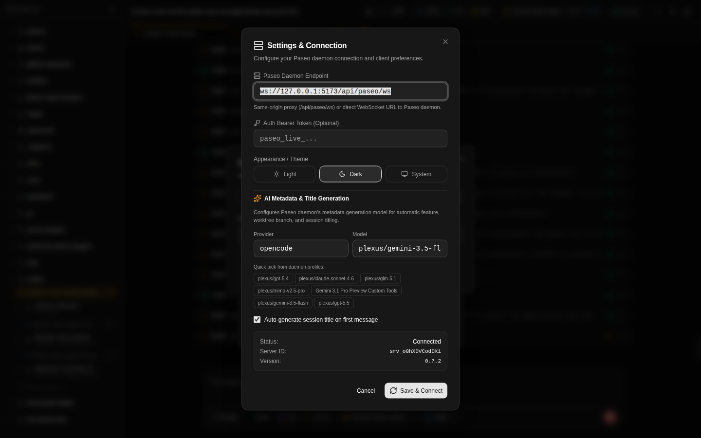
</p>

- **Paseo Daemon Endpoint**: Specify `/api/paseo/ws` (for the built-in same-origin proxy) or a direct URL (`ws://127.0.0.1:6767/ws`).
- **Auth Bearer Token**: Optional bearer token for authenticated daemon instances.
- **Theme Preference**: Choose between **Light** (Warm Paper), **Dark** (Warm Night), or **System**.
- **AI Metadata & Title Generation**: Select the provider and model used by Paseo to automatically title sessions and feature branches.

---

## Keyboard Shortcuts

| Shortcut | Action | Context |
|---|---|---|
| `Enter` | **Steer Agent** | Inside composer when agent is actively generating |
| `⌘ + Enter` / `Ctrl + Enter` | **Interrupt Agent** | Instantly stop current agent generation |
| `⌥ + Enter` / `Alt + Enter` | **Queue Follow-up** | Add instruction to run immediately after active turn |
| `Esc` | **Close Modal / Drawer** | Dismiss dialogs, popovers, or sidebar drawer |

---

## License

This project is licensed under the MIT License.
